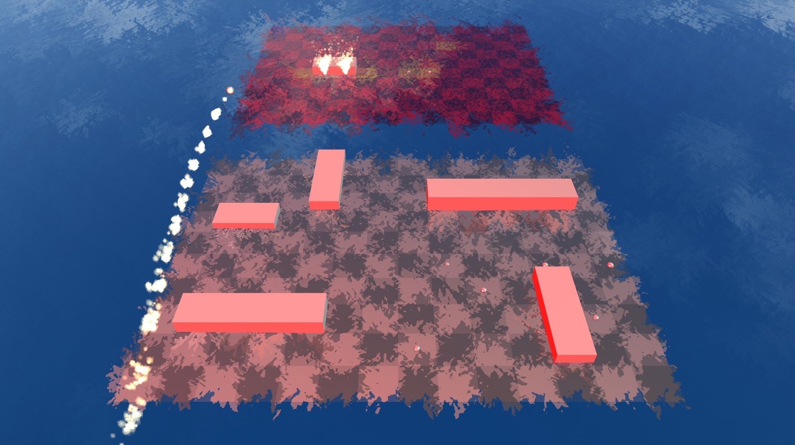

# [Advanced Battleship][advanced_battleship]
[advanced_battleship]: http:advancedbattleship.com


### Description
Advanced Battleship is based on the original Battleship and its variation Battleship: Advanced Mission.

### Technologies Used
HTML5, WebGL, Babylon.js

### Features Overview
- [ ] 3D gameplay
- [ ] Computer Player AI
- [ ] Simulated ocean
- [ ] Missile attack
- [ ] Sound effects
- [ ] Fluid animations
- [ ] Alternate view



### Babylon.js Animation Creation
```javascript
_sinkAnimation(parent) {
  const animationSinkY = new BABYLON.Animation(
    "sinkAnimation",
    "position.y",
    30,
    BABYLON.Animation.ANIMATIONTYPE_FLOAT,
    BABYLON.Animation.ANIMATIONLOOPMODE_CONSTANT
  );
  const animationSinkRotationY = new BABYLON.Animation(
    "sinkAnimation",
    "rotation.y",
    30,
    BABYLON.Animation.ANIMATIONTYPE_FLOAT,
    BABYLON.Animation.ANIMATIONLOOPMODE_CONSTANT
  );
  const animationSinkRotationZ = new BABYLON.Animation(

    "sinkAnimation",
    "rotation.z",
    30,
    BABYLON.Animation.ANIMATIONTYPE_FLOAT,
    BABYLON.Animation.ANIMATIONLOOPMODE_CONSTANT
  );
  let keys = [];
  keys.push({frame: 0, value: parent.position.y});
  keys.push({frame: 3000, value: parent.position.y - 2000});
  animationSinkY.setKeys(keys);
  keys = [];
  keys.push({frame: 0, value: parent.rotation.y});
  keys.push({frame: 3000, value: parent.rotation.y - 20});
  animationSinkRotationY.setKeys(keys);
  keys = [];
  keys.push({frame: 0, value: parent.rotation.z});
  keys.push({frame: 3000, value: parent.rotation.z - 20});
  animationSinkRotationZ.setKeys(keys);


  const easingFunction = new BABYLON.QuadraticEase();
  easingFunction.setEasingMode(BABYLON.EasingFunction.EASINGMODE_EASEIN);
  animationSinkY.setEasingFunction(easingFunction);
  animationSinkRotationY.setEasingFunction(easingFunction);
  animationSinkRotationZ.setEasingFunction(easingFunction);

  parent.animations.push(animationSinkY);
  parent.animations.push(animationSinkRotationY);
  parent.animations.push(animationSinkRotationZ);

  const missile_impact = new BABYLON.Sound( "Music", "sounds/missile_impact.wav",
    scene, null, { loop: false, autoplay: true }
  );
  for (var i = 0; i < 5; i++) {
    setTimeout(
      () => {
        missile_impact.play();
      },
      i * 300
    );
  }
  scene.beginAnimation(parent, 0, 3000, false);
}
```

### Opponent AI Logic
```javascript
_nextFirePos() {
  let validSurrounding = [];
  const board = game.player.boardObject;
  let hitSpaces = board.shipHitSpaces;
  let nextPos;
  let invalidPosition = true;
  while (validSurrounding.length === 0 || invalidPosition) {

    if (hitSpaces.length === 0) {

      return null;

    } else if (hitSpaces.length === 1) {

      const surrounding = [
        {x: hitSpaces[0].x, z: hitSpaces[0].z + 20},
        {x: hitSpaces[0].x, z: hitSpaces[0].z - 20},
        {x: hitSpaces[0].x + 20, z: hitSpaces[0].z},
        {x: hitSpaces[0].x - 20, z: hitSpaces[0].z}
      ];
      validSurrounding = surrounding.filter( space => board.validPos(space) );
      if (validSurrounding.length > 0) {
        invalidPosition = false;
        nextPos = validSurrounding[Math.floor(Math.random() * validSurrounding.length)];
      } else {
        invalidPosition = true;
        hitSpaces = board.shipHitSpaces;
        hitSpaces = [hitSpaces[Math.floor(Math.random() * hitSpaces.length)]];
      }
    } else {

      const randomIndex = Math.floor(Math.random() * hitSpaces.length);
      const space = hitSpaces[randomIndex];
      const surrounding = [
        {x: space.x, z: space.z + 20},
        {x: space.x, z: space.z - 20},
        {x: space.x + 20, z: space.z},
        {x: space.x - 20, z: space.z}
      ];
      const surroundingHits = [];
      surrounding.forEach( surroundingSpace => {
        if (board.hasBeenHit(surroundingSpace)) {
          surroundingHits.push(surroundingSpace);
        }
      });
      const adjacentSpace = surroundingHits[Math.floor(Math.random() * surroundingHits.length)];
      let dir;
      if ((adjacentSpace.x - space.x) !== 0) { dir = "VERTICAL"; }
      else if ((adjacentSpace.z - space.z) !== 0) { dir = "HORIZONTAL"; }

      let i = 20;
      let notFound1 = true;
      let notFound2 = true;
      let space1;
      let space2;

      while (notFound1 || notFound2) {
        switch (dir) {
          case "VERTICAL":
            if (notFound1) { space1 = {x: space.x + i, z: space.z}; }
            if (notFound2) { space2 = {x: space.x - i, z: space.z}; }
            break;
          case "HORIZONTAL":
            if (notFound1) { space1 = {x: space.x, z: space.z + i}; }
            if (notFound2) { space2 = {x: space.x, z: space.z - i}; }
            break;
        }

        if (notFound1 && hitSpaces.every( s => s.x !== space1.x || s.z !== space1.z )) { notFound1 = false; }
        if (notFound2 && hitSpaces.every( s => s.x !== space2.x || s.z !== space2.z )) { notFound2 = false; }

        i += 20;
      }

      if (board.validPos(space1) && board.validPos(space2)) {
        invalidPosition = false;
        nextPos = (Math.floor(Math.random() * 2)) ? space1 : space2;
      } else if (board.validPos(space1)) {
        invalidPosition = false;
        nextPos = space1;
      } else if (board.validPos(space2)) {
        invalidPosition = false;
        nextPos = space2;
      } else {
        hitSpaces = [hitSpaces[Math.floor(Math.random() * hitSpaces.length)]];
      }
      validSurrounding = [nextPos];
    }
  }
  return nextPos;
}
```

### Upcoming Features/Improvements
- [ ] Multiplayer
- [ ] Additional weapons
- [ ] Realistic ship models
- [ ] Improved instructions
- [ ] Smarter AI
- [ ] Saved games
- [ ] Graphics settings
